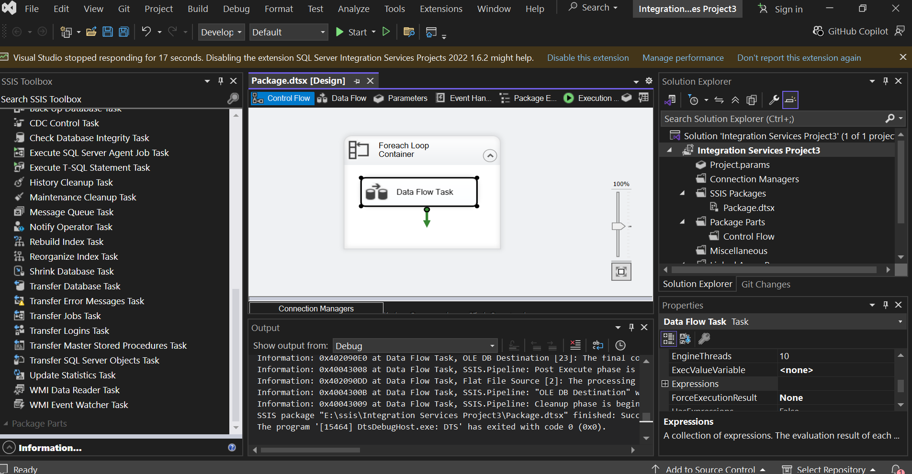
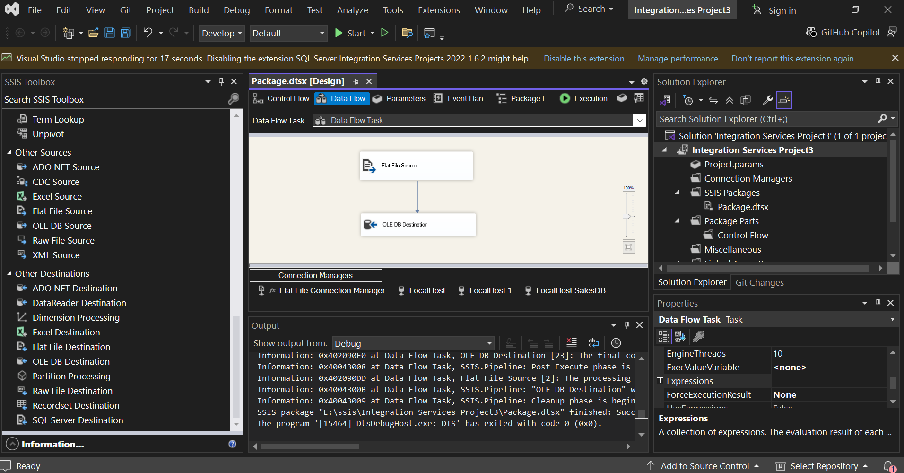

# SSIS-CSV-to-SQL-ForeachLoop 🔄

This is an ETL (Extract, Transform, Load) project built using **SSIS (SQL Server Integration Services)**. It is designed to automatically load multiple CSV files from a specific folder into a SQL Server database.

##  Key Features
* **Foreach Loop Container**: Automatically iterates through all files in a source folder. 
* **Dynamic Connection Manager**: Uses Expressions and Variables (`FilePath`) to update the connection string for each file during the loop. 
* **Data Flow Task**: Efficiently extracts data from Flat File sources and loads it into an OLE DB destination. 
* **Data Type Mapping**: Ensures data integrity by converting CSV text data into proper SQL formats (e.g., mapping `SaleDate` to `DT_DATE`). 

##  Project Structure
* **/sql**: Contains the SQL script to create the database and the `AllSales` table. 
* **/data**: Includes sample CSV files (e.g., Branch A, B, C) for testing. 
* **Package.dtsx**: The main file containing the ETL logic and control flow. 
* **Integration Services Project.sln**: The Visual Studio solution file to open the project. 

## Setup Instructions
1. **Database Setup**: Run the script found in the `/sql` folder within SQL Server Management Studio (SSMS).
2. **Open Project**: Open the `.sln` file in Visual Studio with SQL Server Data Tools (SSDT).
3. **Configure Variables**: Update the `FilePath` variable to match the folder path on your local machine.
4. **Execution**: Press the 'Start' button to run the package and load the data.

## Project Logic (Screenshots)
### Control Flow

### Data Flow & Mappings
